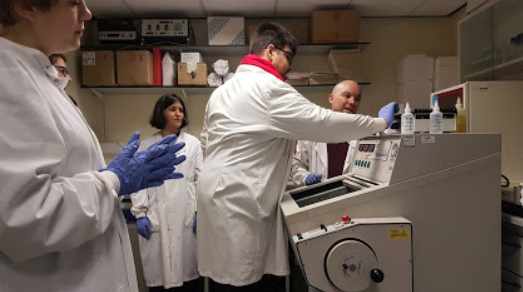
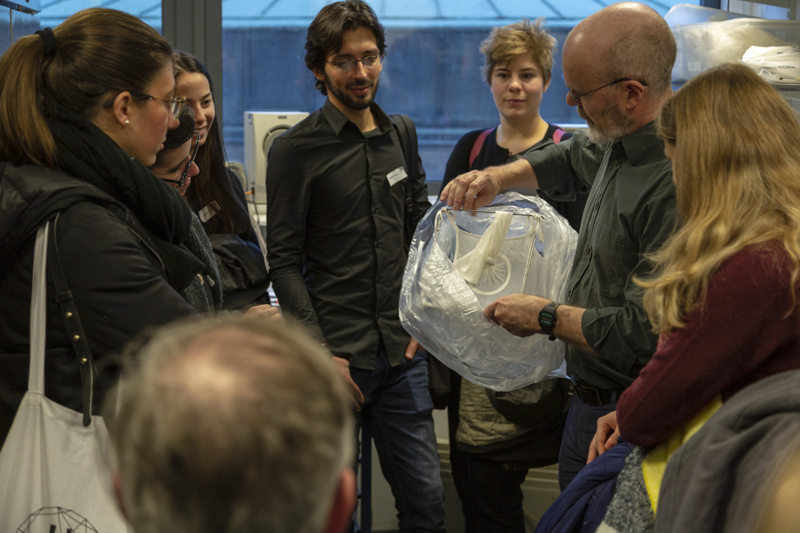
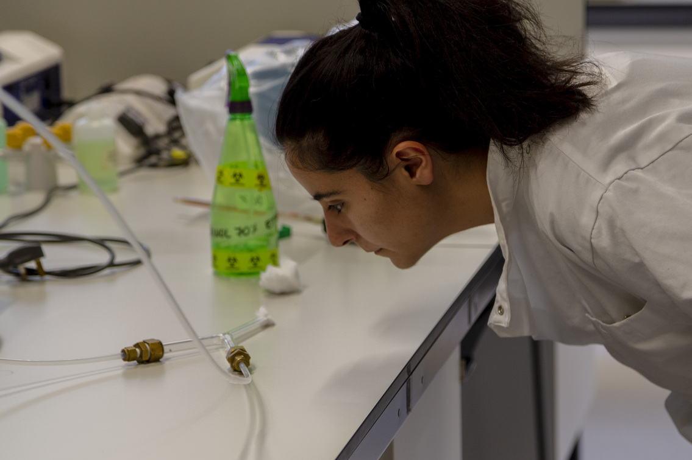
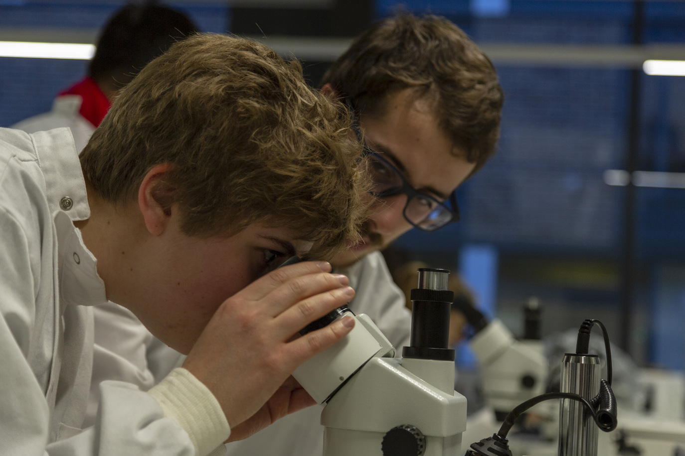
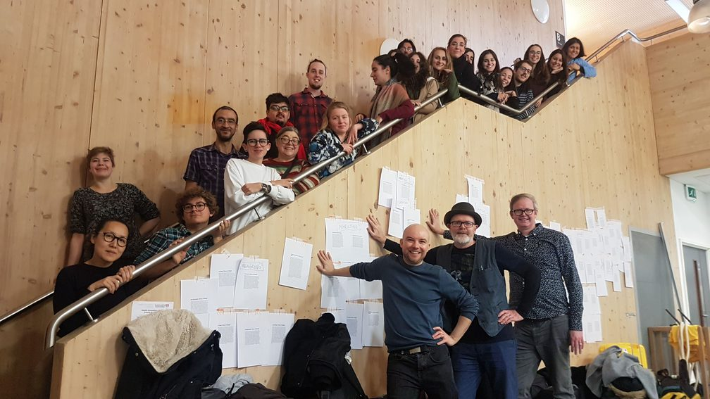

# Disrupt > Encode > Consolidate

# :syringe: :speech_balloon: :art: :microscope: :mouse: :card_index:

 
 

The **DEC SynaNet** workshops are complete! We had a whirlwind of presentations, interactions, good food and conversation, workshops, writing and making. Here are a collection of presentations and prototype publications of our first steps across art practices and neuroscience.

If you want to know more contact <a href="mailto:r.dalziel@lancaster.ac.   uk?subject=Disrupt, Encode, Consolidate Information Request">Artistic Coordinator Ross Dalziel</a>

# Presentations :bar_chart: :computer:

Below you can find information on all DEC presenters and links to their presentations

[Zarko Alecsic](http://www.zarkoaleksic.com/) - [Brain Pictures](presentations/ZarkoAlecsic.pdf)
[Dr Sue Broughton](http://www.lancaster.ac.uk/fhm/about-us/people/susan-broughton) - [Neuroscience and Ageing Research Using the Fruit Fly](presentations/SueBroughton.pdf)
[Dr Neil Dawson](http://www.lancaster.ac.uk/fhm/about-us/people/neil-dawson) - [Preclinical brain imaging: why & how?](presentations/NeilDawson.pdf)
[Dr Rod Dillon](http://www.lancaster.ac.uk/fhm/about-us/people/rod-dillon) - [What Does It Mean to be an Artistic Scientist with a Parasitic Alter Ego?](presentations/RodDillon.pdf)
[Tony Hall](http://www.antonyhall.net/) - [RE-Action Lab](presentations/AnthonyHall.pdf)
[Sam Meech](http://smeech.co.uk) - [Feedback Form](presentations/SamMeech.pdf)
[Jasmine Marker](https://cargocollective.com/mycongarde) - [Matter of Communication](presentations/JasmineMarker.pdf)
[Manoli Moriaty](https://manolimoriaty.com) - [Symbiotic Synergies - Organisation and Mutual Exploitation in Interdisciplinary Collaboration](presentations/ManoliMoriaty.pdf)
[Stuart Nolan](http://stuartnolan.com/) - [Mind Readings: 19th century mentalism and emerging neuro-tech](presentations/StuartNolan.pdf)
[Xristina Penna](http://xristinapenna.com/) - [Attempts on Post-Representation (multiple drafts) part 2](https://youtu.be/T_u7a_xWEpo)
[Dr Rachel Rigby](http://www.lancaster.ac.uk/fhm/about-us/people/rachael-rigby) - [Characterising the Gut Microbiome](presentations/RachelRigby.pdf)
[Topicbird (Jasper Meiners and Isabel Paehr)](http://thetopicbird.com/) - [Play Forward EXP\_eriments & EXP\_eriences that question virtual gazes](http://future-perspectives.net/)

# :book:

# Photos :camera:

Download a [zip](../media/documentation_photos/jpg.zip) of documentation images.

# Publications :book:

Artist [Hwa-Young Jung](http://slyrabbit.net) delivered a workshop to make a prototype publication to try consolidate some of the meetings and inspirations between artist and scientist over the prrogramme. Inspired by

[The ABC of Neuroscience](presentations/ABC.pdf)

# The future :milky_way:

Things that emerged from the workshops continue to percolate: watch this space!

This workshop is funded by the European Union’s Horizon 2020 research and innovation programme as part of [SynaNET](www.synanet2020.com) under grant agreement number **692340**
