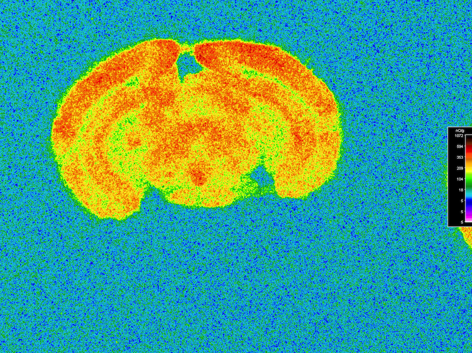

# Call for Artists

## Collaborative Art & Bio-science Workshop at **Lancaster University, UK** on **Monday 17th to Wednesday 19th December 2018**

This collaborative workshop will bring together scientists from the [SynaNET](https://www.synanet2020.com/) network and professional artists to explore key ideas in neuroscience research, BioArt, diverse artistic practices influenced by the life sciences and different ways of working. The workshop aims to ***DISRUPT*** dogmatic thinking across these disciplines, ***ENCODE*** new approaches and insights through shared interactions and ***CONSOLIDATE*** these ideas through artistic expression.

The workshop aims to disrupt assumed narratives of artist as ‘receptors’ and scientists as ’transmitters’ of knowledge in the context of Science and Art collaboration.

Artists are invited to give playful presentations and insights into their practice, ways of working and the conceptual basis of their work. Scientific demonstrations and hands on activity will give both scientists and artists insight into the theory and practical basis of various approaches in neuroscience research including functional brain imaging, behavioral analysis in model organisms, characterization of the microbiome and other techniques. Through working together, scientists and artists will explore the development of novel approaches across their practice.

This is a unique temporary haven to share approaches, develop & build relationships across the life sciences, arts and humanities. Participants take part in hands on activity exploring both neuroscience and art methodology. 

## How To Apply

To apply for the workshop please submit:

 * A brief *Expression of Interest* with an idea for presenting your work or practice (no more than A4) no later than **Monday 29th October 2018**
  * You can focus on a particular project or an idea, involve people in activity, perform, provoke or present slides, media or objects.
 * Brief or recent *Curriculum Vitae*, artist Statement or links to their work
 * Mail this to <a href="mailto:r.dalziel@lancaster.ac.uk?subject=Disrupt, Encode, Consolidate Artist Application&bcc=n.dawson1@lancaster.ac.uk,r.dillon@lancaster.ac.uk">Artistic Coordinator & LICA PhD Candidate Ross Dalziel</a>
 

Artists will be selected by **Monday 5th November** and invited to the workshop. Please note that unfortunately Due to funding restrictions there are no fees available for participation, but all travel, good food, accomodation and a warm Cumbrian welcome will be provided for all participants. Do let us know any support or dietary requirements you might have.

This workshop is funded by the European Union’s Horizon 2020 research and innovation programme as part of [SynaNET](www.synanet2020.com) under grant agreement number **692340**
