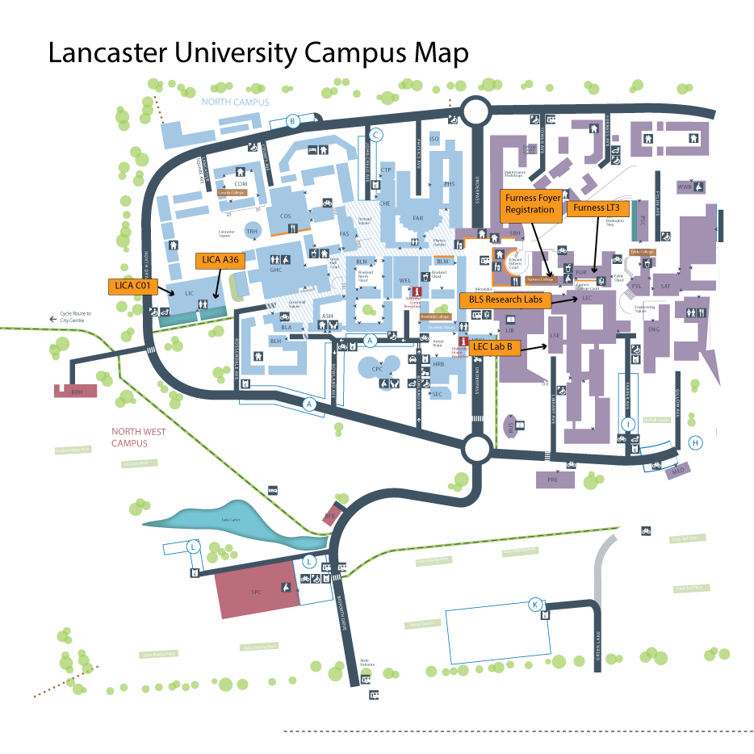

## Collaborative Art & Bio-science Workshop at **Lancaster University, UK** on **Monday 17th to Wednesday 19th December 2018**

### Schedule

### Monday 17th December 2018 -- DISRUPT

|Time|Activity|Location
|------|------|------
|09.00 - 09.30| Registration|Location: Furness Building, Foyer
|9.30 - 10.00|[Stuart Nolan](http://stuartnolan.com/) Mind Readings: 19th century mentalism and emerging neuro-tech.|Furness Building, [LT 3](https://photospheres.lancaster.ac.uk/photospheres/115)
|10.00 - 11.00|Scientist and Artistic Overviews|Furness Building, [LT 3](https://photospheres.lancaster.ac.uk/photospheres/115)
|10.00 - 11.00|[Dr Rod Dillon](http://www.lancaster.ac.uk/fhm/about-us/people/rod-dillon), Lancaster University - What Does It Mean to be an Artistic Scientist with a Parasitic Alter Ego? [Sam Meech - Feedback Form](http://smeech.co.uk)|Furness Building, [Lecture Theatre 3](https://photospheres.lancaster.ac.uk/photospheres/115)
|11.00 - 11.30|Coffee and Networking|Furness Building, Furness Foyer
|11.30 - 12.30|Artistic and Scientific Overviews [Zarko Alecsic](> [[dd]{.underline}](http://www.zarkoaleksic.co/) - Brain Pictures [Dr Sue Broughton](https://www.staffdirectory.lancaster.ac.uk/staffdirectory/staffprofile.aspx?id=00451489), Lancaster University - Neuroscience and Ageing Research Using the Fruit Fly|Furness LT 3
|12.30 - 14.00|Lunch and Networking|Furness Building, Foyer
|14.00 - 16.00|Scientific experience of Sandfly and Fruit Fly research|BLS Research Labs|
|14.00 -- 15.00|Group A; Sandfly, Group B; Fruit Fly|BLS Research Labs
|15.00 - 16.00|Group B; Sandfly, Group A; Fruit Fly|BLS Research Labs
|16.00 - 16.30|Coffee and Networking|Furness Building, Foyer
|16.30 - 17.30|[Topicbird](http://thetopicbird.com/) (Jasper Meiners and Isabel Paehr) - Play Forward EXP\_eriments & EXP\_eriences that question virtual gazes|LEC Teaching Lab B|
|19.30pm| Networking Dinner| Toll House Inn, Lancaster

### Tuesday 18^th^ December 2018 -- ENCODE\>

|Time|Activity|Location
|------|------|------
|8.00|Setup for presenters|LICA foyer/C01
|09.00 - 9.30|[Xristina Penna](http://xristinapenna.com/) - Attempts on Post-Representation (multiple drafts) part 2|LICA C01
|9.30 - 10.00|[Manoli Moriaty](https://manolimoriaty.com) - Symbiotic Synergies - Organisation and Mutual Exploitation in Interdisciplinary Collaboration|LICA C01
|10.00 - 10.30|Coffee & Networking|Furness Building, Foyer
|10.30 - 12.00|Scientific and Artistic Overview [Dr Neil Dawson](https://www.staffdirectory.lancaster.ac.uk/staffdirectory/staffprofile.aspx?id=00537800), Lancaster University - Preclinical brain imaging: why & how? [Tony Hall](http://www.antonyhall.net/) - \[RE\]Action Lab  [Dr Rachel Rigby](https://www.staffdirectory.lancaster.ac.uk/staffdirectory/staffprofile.aspx?id=00419496), Lancaster University - Characterising the Gut Microbiome|Furness Building, LT 3
|12.00 - 13.00|Lunch & Networking|Furness Building, Foyer
|13.00 - 15.00|Scientific experience: Brain Imaging and Microbiome Characterisation|BLS Research Labs
|13.00 - 14.00|Group A; Brain Imaging, Group B; Microbiome|BLS Research Labs
|14.00 - 15.00|Group B; Brain Imaging, Group B; Microbiome|BLS Research Labs
|15.00 - 15.30|Coffee & Networking|Furness Building, Foyer
|15.30 - 16.00|[Jasmine Marker](https://cargocollective.com/mycongarde) - Matter of Communication|LICA A36
|16.00 - 17.00|Round Table Discussions Scientists & Artists; conflicts and companions, where's the line with you; scientist informed practice? Waste and Ethics in Science & Art|LICA A36
|7.30pm|Dinner|Lancaster House Hotel, Lancaster
|9.00pm onward|After Dinner Collaborations (optional); exploring ideas together|Lancaster House Hotel Bar

### Wednesday 19th December 2018 - Consolidate

|Time|Activity|Location
|------|------|-----
|9.00 - 11.00|ABC of Art & Neuroscience activity for post-graduate Lancaster students Facilitated by artist [Hwa-Young Jung](http://slyrabbit.net)|LICA A36
|9.00 - 11.00|Artist and Scientist free time; Time to talk, prototype collaborations make future plans or hack something together|LICA A36
|11.00 - 12.00|Presenting our ABC\'s of Art & Neuroscience and artist collaborations|LICA A36
|12.00 - 12.30|Close, Feedback Collection and Lunch|Furness Building Foyer

#### Hashtags for Social Media

**\#SynaNET** **\#neurodec**

[Full Map](http://www.lancaster.ac.uk/media/lancaster-university/content-assets/documents/maps/campus-map.pdf)
